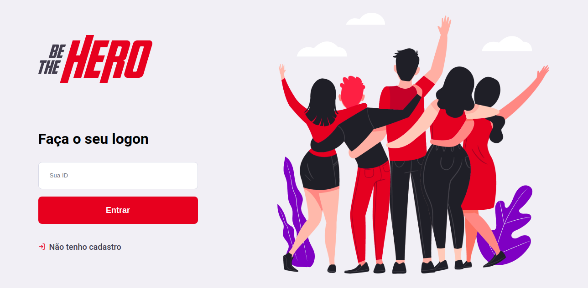
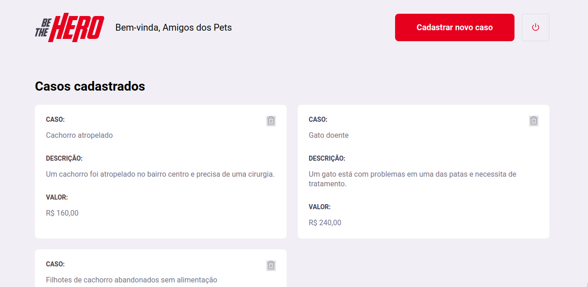
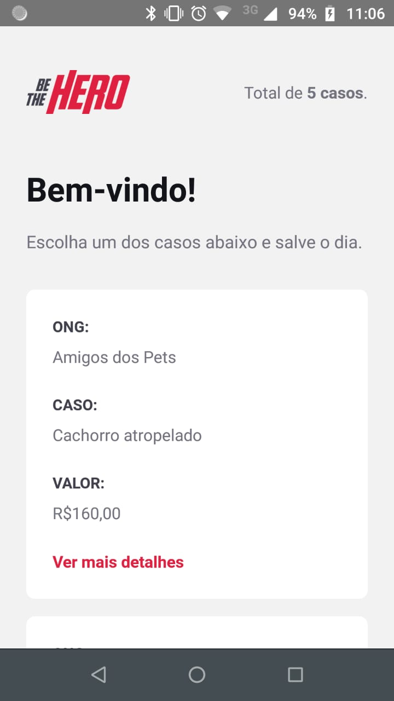

# Be The Hero

Be The Hero é um projeto para facilitar o contato entre ONGs (Organizações não Governamentais) e pessoas que gostariam de ajudar essas organizações, através da publicação de casos e ofertas de ajuda.







## Getting Started
Para rodar a aplicação localmente:
### Back-end
```
npm start
```
### Front-end
```
npm start
```
### Mobile 
```
npx react-native start
```
## Running the tests
Para rodar os testes:
### Back-end
```
npm test
```
## Built With

* [Node.js](https://nodejs.org/en/) - Back-end
* [React](https://pt-br.reactjs.org/) - Front-end
* [React Native](https://reactnative.dev/) - Mobile

## Informações extras

Este projeto fez parte da décima primeira [Semana OmniStack](https://rocketseat.com.br/week/inscricao/11.0). 


